# KDX User Installation Guide

The Kaspa Desktop Experience (KDX) application provides a user interface for running a full Kaspa node (Kaspad) ina desktop operating system environment. The application is intended for both software developers and non-technical users.

KDX includes a wallet for performing Kaspa transactions.

## Key Features

The KDX application enables the user to do the following:

- Install, configure and run a full Kaspa node (Kaspad) on the user&#39;s computer
- Run a Kaspad on Testnet or on Mainnet and easily switch between the networks
- Create a local, self-contained Testnet for running Kaspa (including mining)
- Send and receive funds using a wallet

## Download and Installation

**To install the KDX application:**

1. Download the KDX binaries from [https://kdx.app](https://kdx.app/).
2. Run the file kdx-v1.4.0-windows-x64.exe.
3. Follow the instructions to install KDX.

    The KDX GUI window opens. The Wallet tab is displayed.

    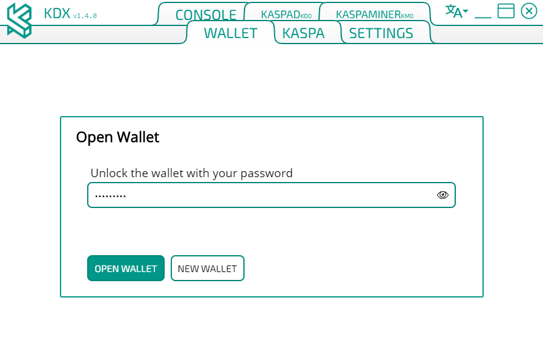

    A Kaspa node (Kaspad) is up and running on Testnet.

## Operation

When opened, the KDX GUI is in Advanced mode (see below) and displays six tabs, of which the following three are standard (non-Advanced):

- Kaspa
- Settings
- Wallet

### Kaspa Tab

The Kaspa tab shows the status of the locally running full Kaspa node (Kaspad).

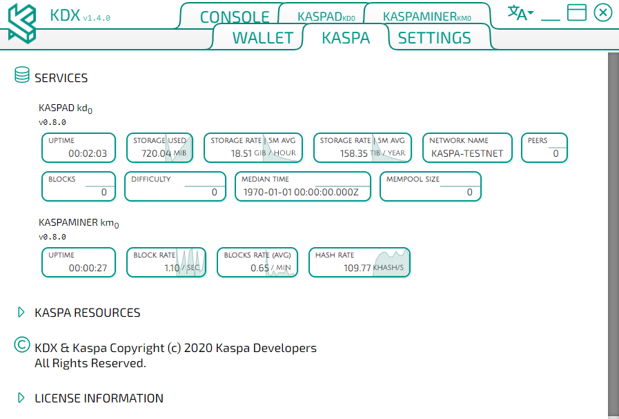

#### Kaspad

The Kaspad part of the tab displays the parameters of the running Kaspad:

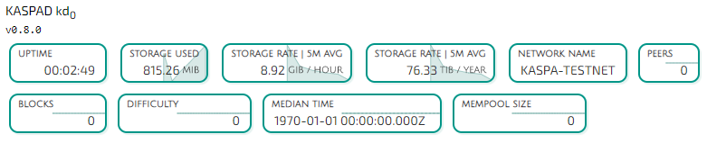

- Storage Used – volume of Kaspa blocks stored locally
- Storage Rate – average hourly rate of adding new blocks (measured every 5 minutes)
- Storage Rate – average yearly rate of adding new blocks (hourly rate extrapolated for a year)
- Network Name – Kaspa-Testnet or Kaspa-Mainnet
- Peers – number of peers the Kaspad is connected to
- Blocks – number of blocks the Kaspad has
- Difficulty – a network parameter (integer)
- Median Time – network time calculated from block timestamps
- Mempool Size – number of pending transactions (broadcasted but not accepted)

#### Kaspaminer

Kaspaminer can be running or stopped depending on whether the Enable Mining checkbox is checked in the Settings tab (see below).

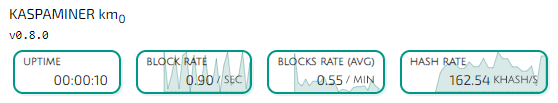

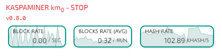

- Block Rate – rate of creating new blocks per second
- Blocks Rate (Avg) – average rate per minute
- Hash rate – number of hashes produced per second (in KHash)

In addition, the KASPA tab provides links to various Kaspa-related resources (Documentation, GitHub and Discord chat) and KDX release notes and displays license information for various KDX components. _(NOT UPDATED, NOT RELEVANT)_

### Settings Tab

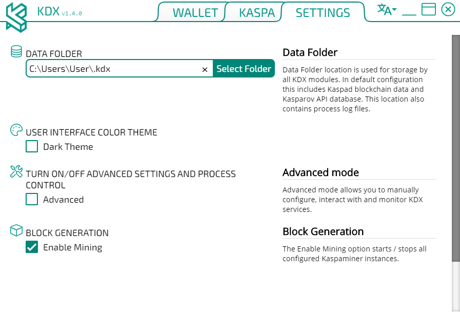

#### Data Folder

This is the folder in which all KDX data is stored. This includes Kaspad blockchain data, log files and the wallet file.

To change the folder&#39;s location, click the ***Select Folder*** button and choose another folder in the Select Folder to Upload window.

#### User Interface Color Theme

The default color theme is dark text on a white background. To reverse the color theme, check the ***Dark Theme*** checkbox.

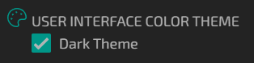

#### Turn On/Off Advanced Settings and Process Control

Checking the  ***Advanced*** checkbox adds several features to the Settings tab and three new tabs to the KDX GUI.

- **Service Control** checkbox

    When this checkbox is checked, KDX runs in the background and is accessible via the system tray menu (on Windows)

- **Metrics** 

    When this checkbox is checked, KDX metrics are streamed to your StatsD-compatible server, for which you can provide an address and prefix.

- **Service Configuration**

    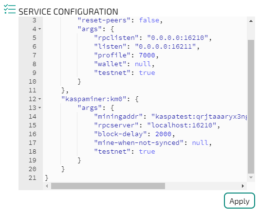

    This is a command-line interface for configuring the way the Kaspad and Kaspaminer run. For the list of possible configurable parameters, see TBD by Anton.

- **Configuration Templates**

    You may select and load a KDX configuration as a premade configuration template.

    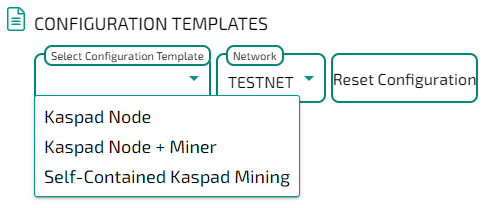

    The following configurations are available:

    Kaspad Node: A single Kaspad node connected to the global Kaspa network
    Kaspad Node + Miner: A single Kaspad node and a miner connected to the global Kaspa network
    Self-Contained Kaspad Mining: A local self-contained Kaspa network comprising two connected Kaspa nodes and a miner

    To change the configuration, select a template from the Select Configuration Template drop-down menu, select the required network (Testnet or Mainnet) from the Network menu and click ***Reset Configuration***.

- **Additional tabs**

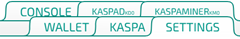

- Console tab

    Not in Use

- Kaspad tab

    This is the console output of Kaspad.

    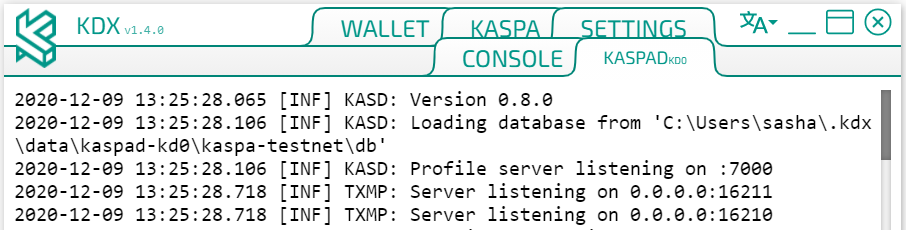

- Kaspaminer tab:

    This is the console output of Kaspaminer.

    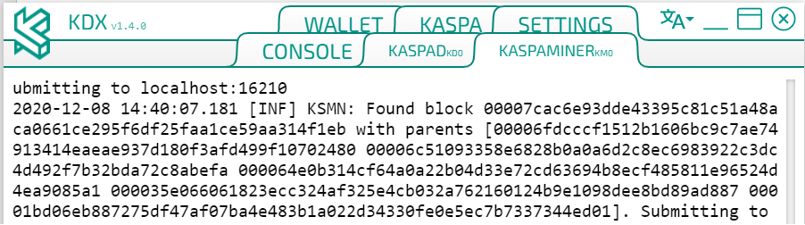

### Wallet Tab

When the Wallet tab is opened for the first time after starting the KDX application, it displays the Open Wallet dialog box.

You can either open an existing wallet or create a new wallet.

**To open a new wallet:**

1. In the Open Wallet dialog box, click ***New Wallet***.

    The Create Wallet window opens.

    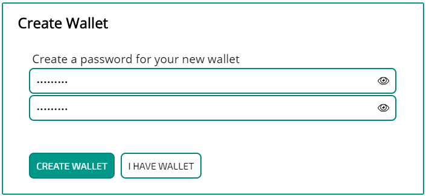

2. Enter a password twice and click ***Create Wallet***.

    The Wallet page opens.

    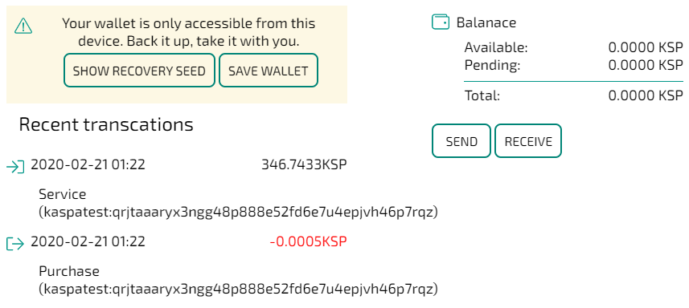

**To open an existing wallet:**

In the Open Wallet dialog box, enter your password and click ***Open Wallet***.

The Wallet page opens, same as above.

#### Wallet Page

The page displays the wallet&#39;s balance, both available and pending (broadcasted but not accepted), and recent transactions.

In addition, the page contains a tool for recovery of the wallet.

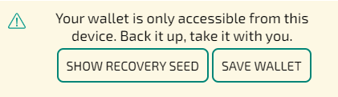

**To generate the recovery seed phrase:**

1. Click ***Show Recovery Seed***.

    The Recovery screen opens.

    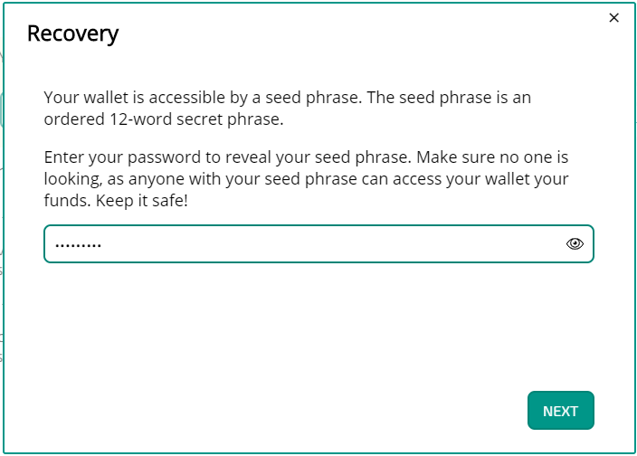

2. Enter your password and click ***Next***.

    An ordered seed phrase is displayed.

    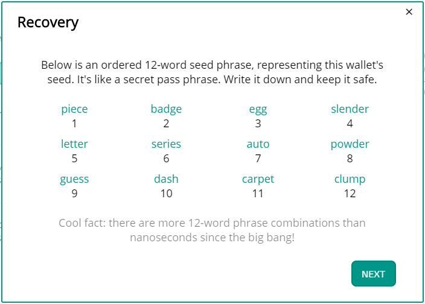

    You have to write it down securely or memorize it. The next screens will check whether you remember the seed phrase.

3. Click ***Next***.

    Answer the questions as prompted and click ***Done***.

    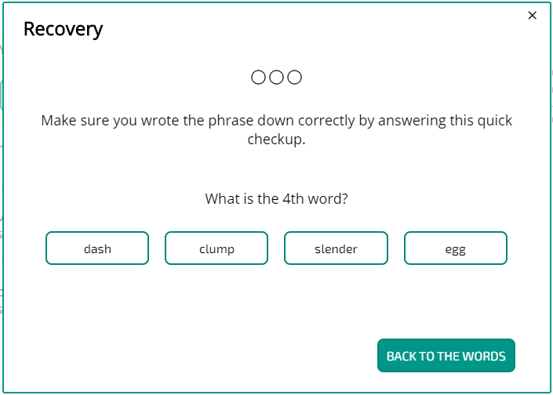 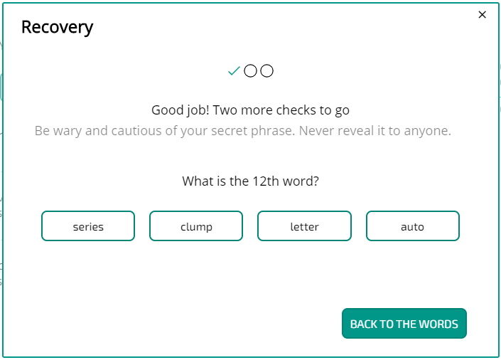

    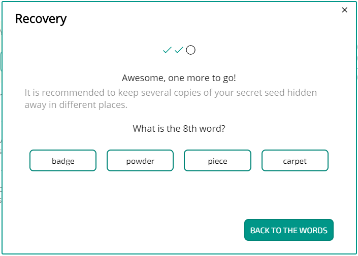 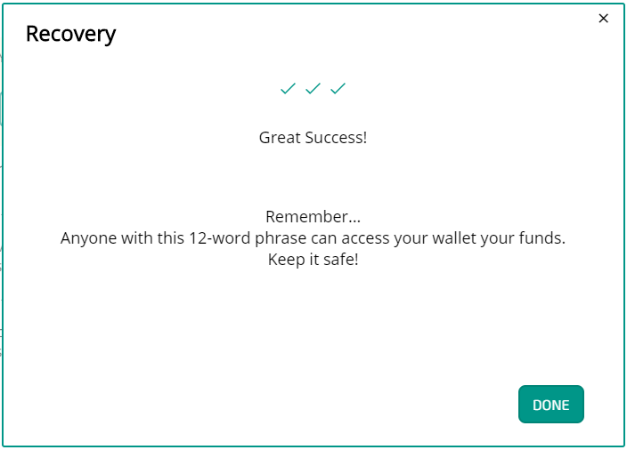

    The recovery seed phrase has been generated.

#### Sending Funds

**To send Kaspa:**

1. On the Wallet page, Click the ***Send*** button.

    The Send window opens.

    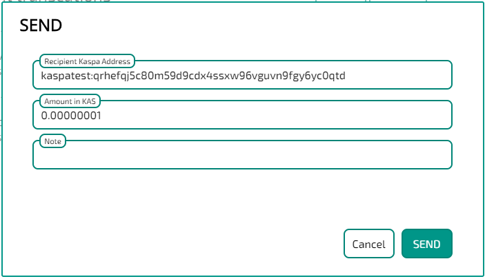

2. Enter the recipient&#39;s address in the Kaspa network and the amount to be sent. You may add a note.
3. Click ***Send***.

    The Password window opens.

    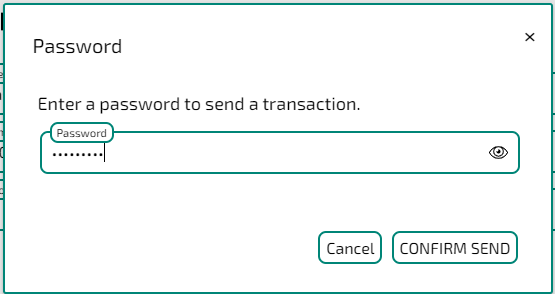

4. Enter your password and click ***Confirm Send***.

    The sending transaction appears in the list of recent transactions on the Wallet page and the available balance is decreased.

#### Receiving Funds

5. On the Wallet page, click ***Receive***.

    The Receive window opens.

    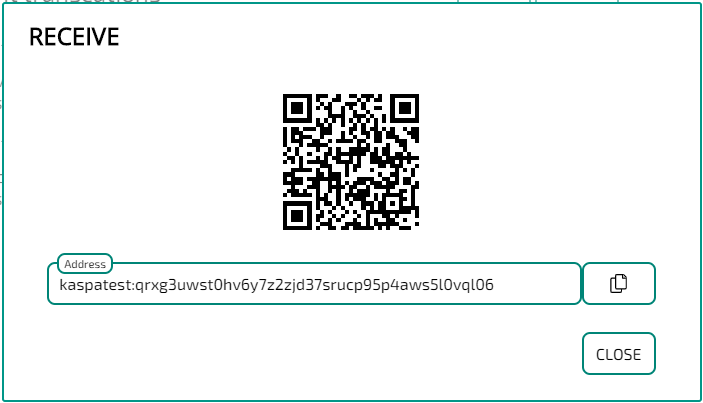

 

    This window displays the sender&#39;s address and its QR code. Press ***Close***.

---

[Back](/Getting%20Started/README.md) | [Docs Home](../../docs/README.md)