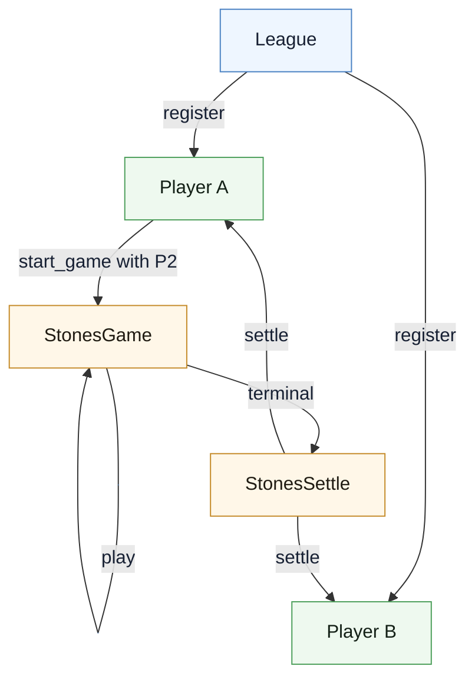
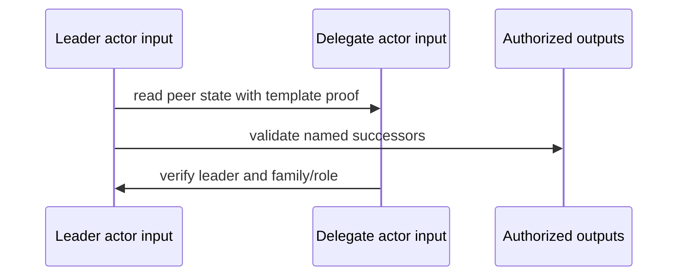

Argent is not a third road beside covenants and based apps.

It is a prototype for the next layer above Silverscript: write a multi-contract covenant system as actors, roles, routes, and typed transitions; lower it into explicit Silverscript and then Kaspa script.

```text
Argent-shaped source -> generated Silverscript -> Kaspa script
```

The analogy is `async` lowering into a state machine. The developer writes the compact source form. The compiler expands it into the mechanical runtime representation: state fields, templates, routing checks, leader/delegate entrypoints, and successor validation.

> [!WARNING]
> Argent is early. Treat [michaelsutton/argent](https://github.com/michaelsutton/argent) as a design direction and prototype, not a production-stable API.

## The Problem It Points At

Silverscript can express multi-contract covenant systems. The difficult part is keeping the route plumbing correct.

A contract family needs to know:

- which roles exist;
- which templates identify those roles;
- which states can transition into which other states;
- which peer inputs are allowed in the same transaction;
- which outputs each entrypoint may authorize;
- which hidden ABI fields must be preserved;
- what launch proof an indexer or auditor needs.

That is too much to leave as copy-pasted convention forever.

## Source Model

Argent prototypes use app-level declarations for actor families.

```rust
app Stones {
    actor League;
    actor Player;
    actor StonesGame;
    actor StonesSettle;
}
```

The vocabulary is actor-shaped:

| Term       | Meaning                                        |
| ---------- | ---------------------------------------------- |
| `app`      | a closed actor/template family                 |
| `state`    | reusable covenant state layout                 |
| `actor`    | a contract template with persistent state      |
| `entry`    | a leader transition                            |
| `delegate` | a non-leader verification path                 |
| `consumes` | peer actors consumed in the same transaction   |
| `emits`    | named authorized outputs                       |
| `become`   | terminal transition into successor actor state |

The output should still be ordinary covenant code. Argent's job is to make the family-level intent explicit before lowering.

## A Multi-Actor Flow

Stones is a contract family, not a single contract.



The generated code has to preserve role identity across changing P2SH state. A shared covenant id can say "same family." It cannot by itself say "this input is a Player and that output is a Game." Template validation carries the role identity.

## Hidden ABI State

Generated Silverscript may carry fields that are not business state.

```text
template_league
template_player
template_stones_game
template_stones_settle
```

Those fields are route-safety state. Ordinary transitions preserve them so later outputs can be validated under the right templates.

That is the kind of data a developer should not hand-maintain in every transition if a compiler can preserve it.

## Route Commitments

Small apps can carry explicit template data. Larger apps probably need route commitments.

The pattern:

```text
hidden state: route_root
entry witness: route leaf + Merkle branch + template prefix/suffix
generated check: leaf belongs to route_root
generated validation: validateOutputStateWithTemplate(...)
```

Commit early, expand late. Long-lived state carries a compact route commitment. The witness expands the route only when a transition needs it.

## Same Template And Foreign Template

When an output continues the same template as the active input, the generated code can use the simpler same-script path:

```text
become self(next_state)
  -> validateOutputState(output_idx, next_state)
```

When an output becomes another actor, the code needs a foreign-template check:

```text
become Player(next_player)
  -> validateOutputStateWithTemplate(output_idx, next_player, prefix, suffix, player_template)
```

Peer input reads are also template-sensitive. Covenant grouping proves family membership. It does not automatically prove actor role.

## Leader And Delegate Defaults

A good default actor transition has one leader and small delegates.



The leader reads peers and validates outputs. Delegates check that a valid leader is taking responsibility and that they are not authorizing stray outputs.

This default leaves room for ordinary fee/change inputs and multiple auth groups in the same transaction.

## Launch Proofs

Multi-contract apps need launch artifacts.

An indexer or auditor should be able to reconstruct:

- the covenant id genesis material;
- template preimages;
- hidden ABI state;
- route commitments;
- current UTXOs and actor roles;
- transaction-builder context.

This is one of the places Argent-like tooling becomes more than syntax. A generated app should come with the artifact needed to read it.

## The Compiler Obligation

Generated code should eventually enforce:

- declared covenant input layout;
- declared authorized output layout;
- hidden ABI state preservation;
- typed foreign input checks;
- same-template shortcuts where sound;
- route membership checks;
- successor state validation;
- no transition into an undeclared output route.

Everything else should be ordinary app policy that a human can review.

## How To Use Argent Today

Use Argent as a design lens.

It helps when:

- one contract is not enough;
- the app has distinct roles;
- route safety is part of correctness;
- launch proofs are needed for readers or auditors;
- transaction builders become part of the protocol surface.

For production covenant work today, start in Silverscript. Borrow Argent's way of thinking about roles, routes, and generated lowering.

Use [Decision Guide](./decision-guide) when deciding whether a multi-contract covenant family is still the right architecture, or whether the app has crossed into based-app territory.
