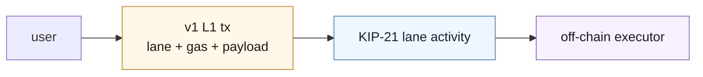
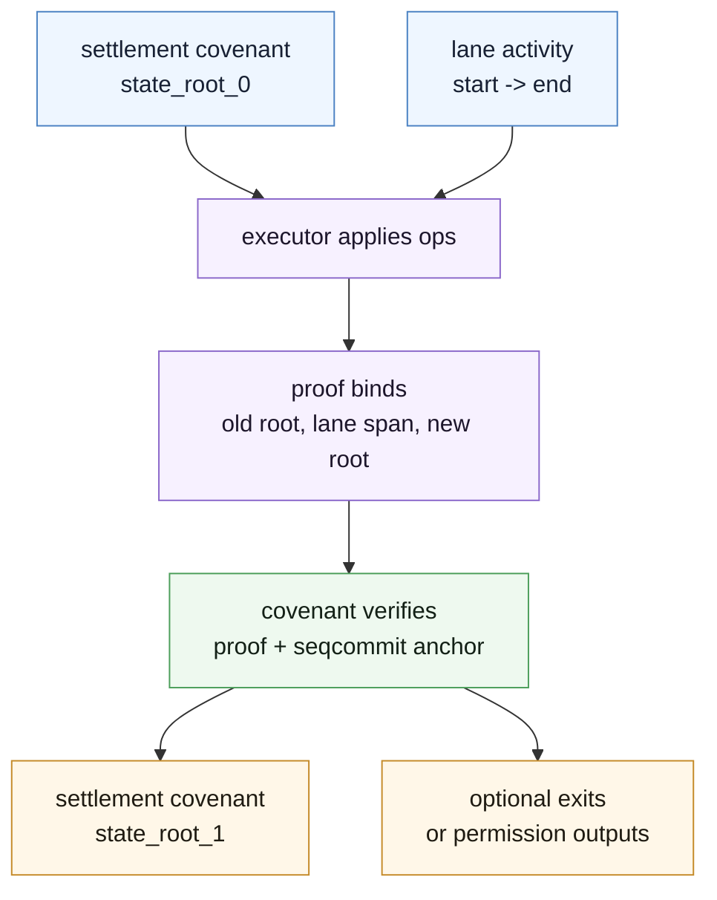
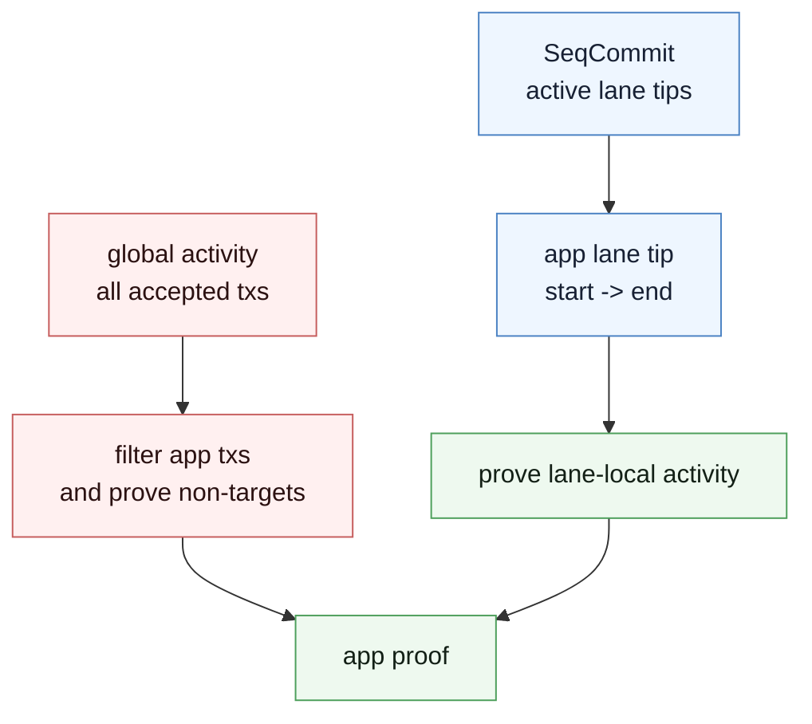
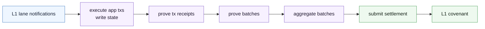

A based app starts with an ordinary L1 transaction.

Not a covenant spend. Not an account-chain call. A v1 Kaspa transaction whose `subnetwork_id` points at an app lane and whose payload carries an operation the app understands.



L1 orders the operation and makes it available. The app runtime executes it off-chain. A settlement covenant later verifies a proof that the off-chain state moved correctly.

## The Boring User Operation

The user operation is ordinary at consensus level.

It is a v1 transaction with:

| Field                 | Based-app meaning                          |
| --------------------- | ------------------------------------------ |
| `subnetwork_id`       | app lane namespace                         |
| `gas`                 | lane gas commitment                        |
| `payload`             | app operation bytes                        |
| normal inputs/outputs | payment, fees, or app-specific conventions |

The chain does not parse the app operation. The app runtime does.

This split assigns ordering, data availability, and lane commitments to Kaspa L1. The app supplies execution semantics.

## The Settlement Covenant

The app also has an L1 covenant. This covenant does not execute every user operation directly. It tracks a compact commitment to the app state and accepts settlement proofs.

A settlement spend says:

```text
I started at app_state_root_0.
I consumed this span of L1 lane activity.
I executed the app rules correctly.
I ended at app_state_root_1.
I produced any required exits or permission outputs.
```



The covenant is the L1 settlement point. The runtime is where the app lives.

## Why Lanes Exist

Imagine doing this with one global accepted-transaction stream.

An app proof would need to show:

- which transactions targeted the app;
- which transactions did not target the app;
- where the app's sequence starts and ends inside all unrelated DAG activity.

That makes an app-local proof pay for global activity.

KIP-21 changes the object being proven. Instead of proving over the whole DAG stream, the app proves over its lane.



The proof model becomes:

1. prove the app lane is included at a start anchor;
2. prove the lane-local transition over the app's activity;
3. prove the app lane is included at an end anchor.

That is the difference between proving your app and proving the world around your app.

## `OpChainblockSeqCommit`

The settlement covenant needs an L1 anchor. `OpChainblockSeqCommit` lets script read the sequencing commitment of a recent selected-parent-chain block.

The block must be known, selected-parent-chain visible from validation, within the access threshold, and post-Toccata KIP-21 compatible.

For deployed parameters, the access window is tied to finality depth. Mainnet finality duration is `43,200` seconds, about 12 hours of target block time.

The proof must bind to the seqcommit the script reads. Otherwise the executor could prove a valid transition over the wrong L1 activity.

## vprogs Runtime Shape

`vprogs` is the evolving reference runtime for this path.

The runtime pattern is:



A useful runtime property is that proofs do not sit on the user-operation critical path. Execution can commit app state, while proof workers produce receipts, batches, aggregates, and settlement artifacts behind it.

Current high-level patterns:

- every L1 chain block becomes a batch, even if empty;
- payload metadata declares resource access;
- transaction receipts compose into batch receipts;
- batch receipts compose into aggregate receipts;
- the aggregate settlement journal is what the L1 covenant checks.

Treat this as an evolving runtime, not a frozen external SDK.

## Guest Program Sketch

A transaction processor guest is ordinary Rust-shaped code inside a RISC Zero guest.

```rust
#![no_std]
#![no_main]

use vprogs_zk_abi::transaction_processor::process_transaction;
use vprogs_zk_backend_risc0_api::{Host, Journal, Sha256};

risc0_zkvm::guest::entry!(main);

fn main() {
    process_transaction::<Sha256>(
        &mut Host,
        &mut Journal,
        |_tx, _merge_idx, _context_hash, resources, _exits| {
            for resource in resources.iter_mut() {
                if resource.is_new() {
                    resource.resize(4);
                }

                let new_value =
                    u32::from_le_bytes(resource.data().try_into().unwrap()) + 1;
                resource.data_mut().copy_from_slice(&new_value.to_le_bytes());
            }

            Ok(())
        },
    );
}
```

This minimal guest increments each touched resource. The instructive part is the data flow: the host feeds encoded inputs, the guest updates resources, and the journal becomes material for later proof composition.

## Settlement Journal

The current vprogs aggregate ABI uses a 320-byte `StateTransition` journal. In field order, it commits:

| Field                 | Meaning                                                 |
| --------------------- | ------------------------------------------------------- |
| `prev_state`          | app state root before the bundle                        |
| `prev_lane_tip`       | lane tip entering the bundle                            |
| `new_state`           | app state root after the bundle                         |
| `new_lane_tip`        | lane tip after the bundle                               |
| `new_seq_commit`      | chain-block seqcommit derived from the final lane proof |
| `covenant_id`         | settlement covenant id                                  |
| `tx_image_id`         | transaction processor guest image id                    |
| `batch_image_id`      | batch processor guest image id                          |
| `permission_spk_hash` | exit permission script hash, or zero when no exits      |
| `lane_key`            | KIP-21 lane key                                         |

The settlement script hashes the journal in the expected order and verifies that the proof produced exactly that journal.

## Proof Modes

The current vprogs settlement path uses two L1 proof modes:

| Proof type                   | L1 precompile tag | Notes                                                      |
| ---------------------------- | ----------------- | ---------------------------------------------------------- |
| RISC Zero Succinct           | `0x21`            | STARK-based, larger, with post-quantum security properties |
| RISC Zero reduced to Groth16 | `0x20`            | compact BN254 proof, not post-quantum                      |

Other VMs or proof systems can be adopted later if they reduce to something Kaspa can verify on L1, or if new precompiles are added.

## What Is Still Moving

The based-app stack is early.

Watch these areas:

- stable external APIs;
- reorg handling for in-flight aggregate proofs;
- settlement submission and fee bumping;
- witness serving and lane-proof ergonomics;
- production operator workflows;
- transaction builders for end-user apps.

Use [Decision Guide](./decision-guide) to decide whether you need this machinery, or whether an L1 covenant family is the better first architecture.
