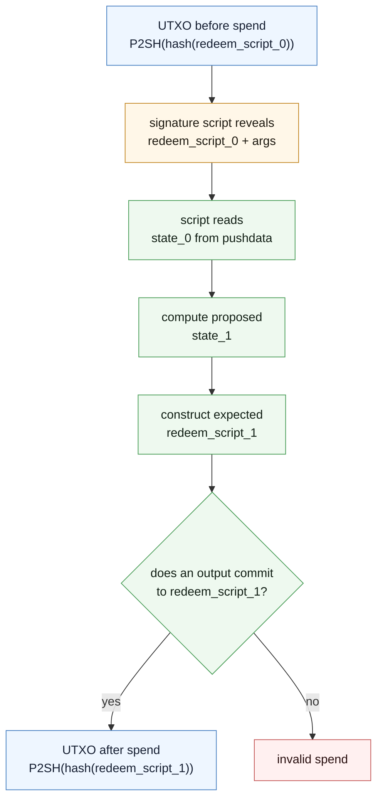
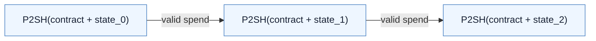
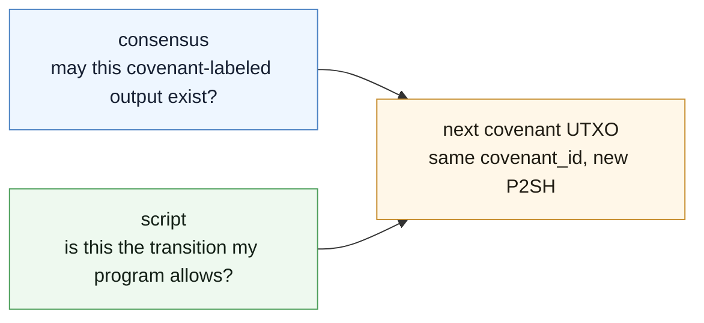
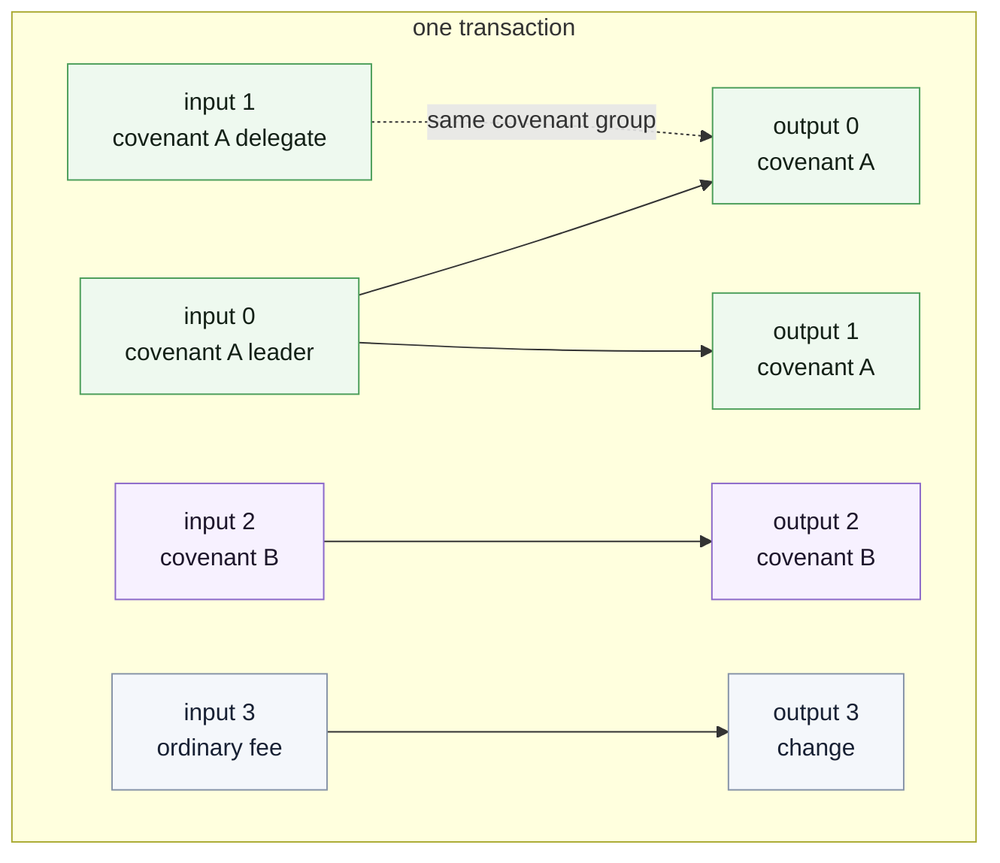
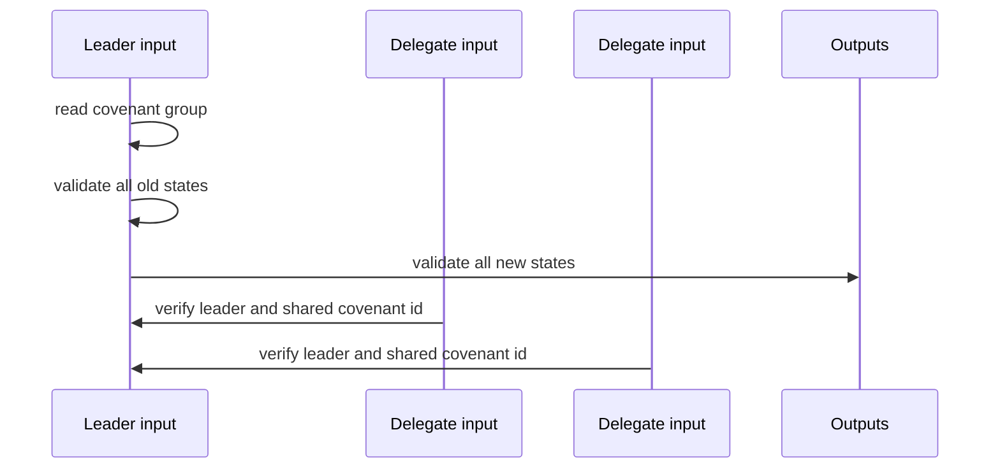
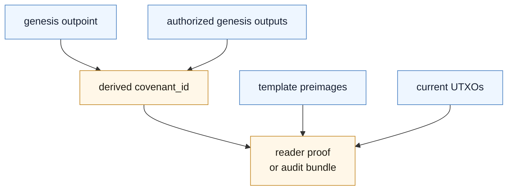

Covenants are easiest to understand by following one UTXO through a spend.

Suppose you want a counter. The policy is simple: only increase the number, and never increase it by more than `max_step`.

```js
pragma silverscript ^0.1.0;

contract Counter(int init_count, int max_step) {
    int count = init_count;

    #[covenant.singleton(mode = transition)]
    function increment(State prev_state, int step) : (State) {
        require(step > 0);
        require(step <= max_step);
        return({ count: prev_state.count + step });
    }
}
```

The interesting part is where `count` lives.

It is not an account variable. It is not a node-side object. It is data inside the redeem-script preimage of the current UTXO.

## The P2SH state pattern

The live output is compact:

```text
script_public_key = P2SH(hash(redeem_script_0))
```

The hidden preimage is where the app lives:

```text
redeem_script_0 = push state_0
                  push contract constants
                  contract code
```

When the UTXO is spent, the transaction reveals `redeem_script_0`. The pushed state becomes a constant for this one script execution. The script then uses the transaction's arguments and outputs to decide whether the spend is allowed.



That is the covenant loop:

1. The chain stores a short commitment.
2. The spend opens the old contract and old state.
3. The script computes the allowed next state.
4. The script verifies that the transaction recreates the contract with that next state.

The fourth step is the part older script systems struggle with. A covenant has to build or inspect enough bytes to know what the next output means. Toccata's byte and hash tools, including `OpCat`, `OpSubstr`, `OpBlake2b`, `OpBlake3`, and output introspection, are what make this pattern practical.

## Why the hash keeps changing

The P2SH hash commits to both contract and state. That supports state validation, but it creates a naming problem.



If the script hash is the covenant's only identity, the covenant changes its name every time its state changes.

Bitcoin-style designs can work around this with parent or grandparent preimages. The idea is to make fake successors unspendable by requiring the next spender to prove a relationship to the previous transaction. That works, but it is heavy: recursive preimages become part of the protocol, witness data grows, and the chain still does not know that a family of changing script hashes is one covenant lineage.

Toccata makes lineage explicit.

## Covenant IDs

KIP-20 adds a covenant label to UTXOs.

```rust
CovenantBinding {
    authorizing_input: u16,
    covenant_id: Hash,
}
```

An output may declare that it belongs to a covenant. When it becomes a UTXO, the UTXO entry carries the same `covenant_id`.

Consensus enforces the entrance rule:

- a continuation output may carry covenant id `id` only if its `authorizing_input` spends a UTXO that already carries `id`;
- a genesis output may carry `id` only if the id is derived from the authorizing outpoint and the authorized initial outputs.

The script enforces the transition rule:

- the covenant input must verify the next state, output layout, amounts, and bindings.

Those two halves are easy to blur, but they do different jobs.



Consensus blocks unauthorized entrance into a covenant family. The script checks whether the next state is actually valid.

This is also why a covenant id on an ordinary P2PK-style output is not sufficient by itself. If the spending script only checks a signature, then it only checks a signature. Covenant behavior appears when the script actually reads covenant data and validates covenant outputs.

## Auth groups and covenant groups

A transaction can carry several covenant flows at once. It can also include ordinary inputs and outputs for fees, change, routing, or batching. Scripts therefore need a clean way to ask two different questions.

The auth question is local:

> Which outputs did this input authorize?

The shared covenant question is family-wide:

> Which inputs and outputs in this transaction belong to this covenant id?

Toccata exposes both views.

| Question                           | Opcodes                                                |
| ---------------------------------- | ------------------------------------------------------ |
| outputs authorized by input `i`    | `OpAuthOutputCount(i)`, `OpAuthOutputIdx(i, k)`        |
| inputs belonging to covenant `id`  | `OpCovInputCount(id)`, `OpCovInputIdx(id, k)`          |
| outputs belonging to covenant `id` | `OpCovOutputCount(id)`, `OpCovOutputIdx(id, k)`        |
| binding data on output `o`         | `OpOutputCovenantId(o)`, `OpOutputAuthorizingInput(o)` |

This supports transactions like:



This flexibility lets covenant transactions carry fees, change, batching inputs, or other covenant flows. A covenant script should not have to assume that the entire transaction belongs to it. It should be able to find the subset it must validate and ignore the rest.

Silverscript's covenant macros are mainly about generating this machinery reliably. Argent-style multi-contract source goes one level higher: it lets you describe roles and routes, then lower them into the Silverscript patterns.

## Three useful patterns

Most covenant transitions are built from a small set of patterns.

### Singleton

One input creates one successor.

```text
State_n -> State_n_plus_1
```

This is the counter, vault, or single-UTXO state machine pattern. It is simple, but it is sequential.

### Fanout

One input creates many successors.

```text
State -> State_A + State_B + State_C
```

This is how a covenant can split into parallel lineages: mint tickets, create positions, open games, allocate shards, or distribute token state.

### Merge or many-to-many

Many inputs participate in one transition.

```text
State_A + State_B -> State_C + State_D
```

The common pattern is leader plus delegates. One input performs the full transition check. The other inputs verify enough to know they are being used in the right family and role.



This is a recurring Toccata pattern because it centralizes the expensive reasoning while preventing passive participants from being dragged into the wrong transition.

## Why high frequency changes the design space

Covenants are sometimes dismissed as "one UTXO, one bottleneck." That is true only for designs that force all state through one UTXO.

Kaspa's high-frequency DAG changes the design space. If your application can split state into many live UTXOs, those states can progress independently. The interesting work becomes state layout:

- which state should be durable and long-lived;
- which state should be episodic and short-lived;
- which transitions need merge authority;
- which commitments should be carried early and expanded only when needed.

This is where covenant systems start to look less like single contracts and more like small protocol families.

## Indexers and launch proofs

The live UTXO stores a P2SH commitment, not a decoded state object. A reader that wants to show application state needs a decoding path.

A useful covenant indexer usually tracks:

- the `covenant_id`;
- every live UTXO carrying that id;
- the transaction that created each live UTXO;
- the redeem-script preimage or enough witness data to decode state;
- the genesis data used to derive the covenant id;
- template hashes and route commitments for multi-contract apps.

For serious applications, this becomes a launch proof or audit bundle.



An explorer can show balances and UTXOs with less context. A covenant-aware wallet, app frontend, or auditor needs enough preimage material to explain what those UTXOs mean.

## What to build next

If your app is one live UTXO or many independent UTXO lineages, continue with [Silverscript](./silverscript).

If your app is a family of roles that route between templates, read [Argent](./argent).

If your app has private transitions, expensive logic, or deeply shared state, read [Inline ZK](./inline-zk) and [Based Apps](./based-apps), then use the [Decision Guide](./decision-guide).
