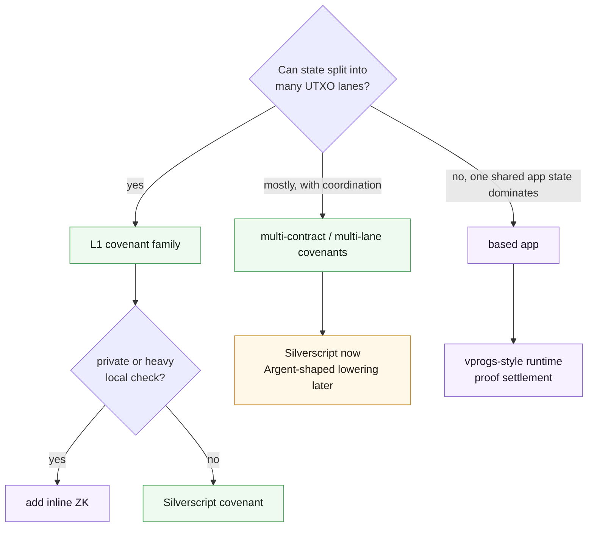

Do not start with "is this app complex?"

Complexity is not the axis. Shared state is.

Ask the awkward question first:

```text
Can the app be expressed as many live UTXO state lanes,
or does it need many users mutating one shared state object?
```

That answer does more work than any smart-contract taxonomy.

## The First Split



The diagram is not a law. It is a way to stop yourself from choosing infrastructure before you have chosen state shape.

## Covenants Are Not The Toy Path

A single mutable UTXO is sequential. That part is real.

But a covenant app does not have to be one UTXO. It can split state into many live UTXOs, let them progress independently, and coordinate only when the protocol actually needs coordination.

With Toccata, L1 covenants can:

- carry state in P2SH preimages;
- keep stable lineage through covenant IDs;
- inspect transaction inputs and outputs;
- validate same-template and foreign-template successor states;
- split into many UTXO lanes;
- merge through leader/delegate transitions;
- use inline ZK for private or expensive local predicates.

Kaspa's 10 BPS target matters here. If an app can partition its state, the DAG gives those lanes room to move. A covenant family that would feel cramped on a slower chain may be practical here.

Start with covenants when:

| If the app needs                                      | Covenant shape                                    |
| ----------------------------------------------------- | ------------------------------------------------- |
| one state lane                                        | singleton covenant                                |
| many independent positions, tickets, vaults, or games | fanout covenant family                            |
| token-like conservation across inputs/outputs         | shared covenant id with leader/delegate           |
| roles and routes                                      | multi-contract Silverscript, Argent-shaped design |
| one private or heavy local predicate                  | inline ZK inside a covenant                       |

## Where Covenants Bite

Covenants get hard when the app secretly wants shared mutable state.

Watch for:

- every user racing for the same live UTXO;
- correctness depending on global absence of UTXOs;
- transaction builders needing to discover and coordinate many state fragments;
- route witnesses growing large;
- launch proofs becoming essential to basic wallet UX;
- users expecting immediate composability with state that lives somewhere else.

Those are not automatic exits. They are design alarms.

Sometimes the right move is still a covenant family with better state layout. Sometimes the right move is a based app.

## Advanced Covenant Patterns

There are covenant designs that push toward shared state without immediately becoming based apps.

### Replicated Shared State

One idea is to create replicas of a shared state UTXO and let updates propagate quickly enough for the app's tolerance.

No consensus change is required. The burden moves into protocol design:

- how stale can a replica be;
- how conflicts resolve;
- what users see while propagation catches up;
- what indexers must prove;
- whether the app's safety model tolerates temporary divergence.

This can be real, but it is not a beginner pattern.

### Miner-Resolved Covenant Inputs

Another idea is to bind a transaction input to a covenant id rather than a specific UTXO, using sighash patterns such as anyone-can-pay or signature-from-stack style constructions. A miner could resolve the exact UTXO while building a block template.

That likely needs mempool and node support. Treat it as a research path or adventurous-team path, not the normal way to ship a first app.

## Based Apps Are Not Bigger Covenants

A based app changes the operational model.

Users submit L1 payload operations. The app runtime executes shared state off-chain. A proof settles the new state root through an L1 covenant.

Choose this when:

- many users mutate one shared app state;
- execution wants batching;
- exits or permission outputs are derived from app execution;
- user operations should not each be covenant spends;
- app logic looks more like a Rust state machine than a UTXO transition;
- private or heavy computation is central rather than occasional.

The cost is infrastructure:

- operators must run execution and proving;
- settlement cadence affects user-visible finality;
- reorg handling and proof pipelines matter;
- L1 composability is often exit-style, not immediate at user-operation time.

Based apps are the right path when the shared-state win pays for that machinery.

## Inline ZK Is A Local Tool

Inline ZK is not the default path for every hard predicate.

Use it when a single covenant transition needs a proof:

- hidden state transition;
- private predicate;
- proof of external state;
- credential or membership check;
- proprietary verification logic.

Avoid it when the app really wants many operations batched into one state transition. That is based-app territory.

## A Practical Rule

Pick the smallest model that carries the real invariant.

1. Use one covenant when the state is naturally sequential.
2. Use a covenant family when state can split into lanes.
3. Use multi-contract covenants when roles and routes matter.
4. Add inline ZK when a transition needs proof verification.
5. Move to a based app when shared state and app-scale execution dominate.

Then check tooling maturity against the product timeline. Consensus features may be active while developer tooling is still catching up.

Continue with [Agent Brief](./agent-brief) if you are about to hand an implementation task to a coding agent.
