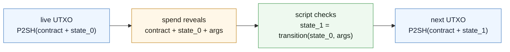
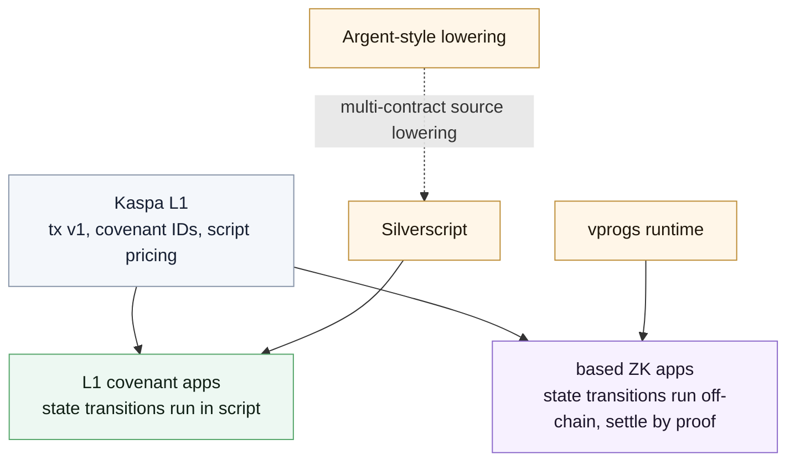
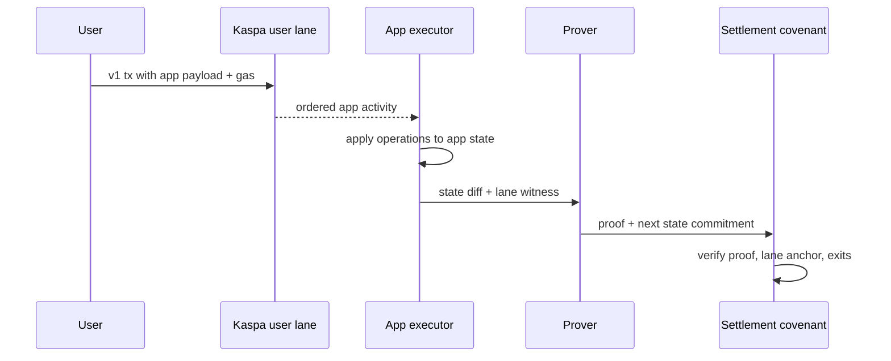
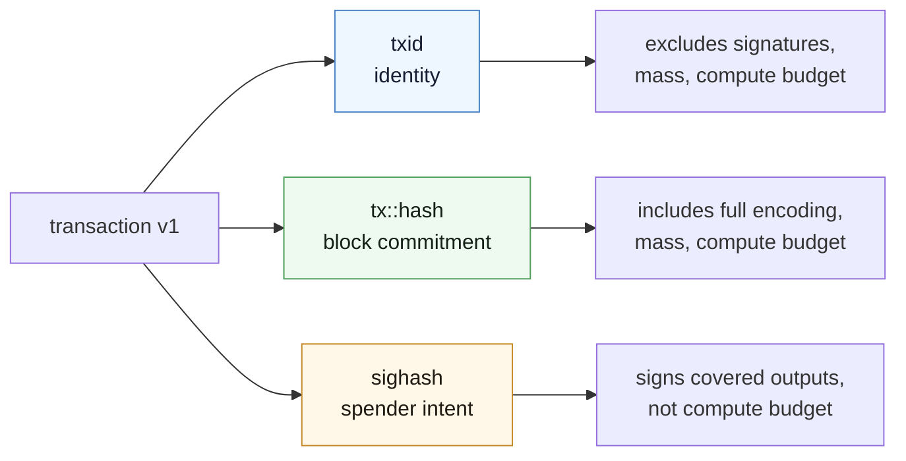

Toccata makes Kaspa UTXOs expressive enough to carry real application state. It is active on mainnet as of June 30, 2026, at DAA score `474_165_565`.

Before listing opcodes, it is better to look at the smallest stateful object Toccata can express: a UTXO that requires its spend to create a valid successor.

The first example is one stateful coin.

```js
pragma silverscript ^0.1.0;

contract Counter(int init_count, int max_step) {
    int count = init_count;

    #[covenant.singleton(mode = transition)]
    function increment(State prev_state, int step) : (State) {
        require(step > 0);
        require(step <= max_step);
        return({ count: prev_state.count + step });
    }
}
```

There is no mutable `Counter` object stored inside a Kaspa node. There is a UTXO whose script public key commits to a script preimage. That preimage contains both the contract and the current state. When the UTXO is spent, the transaction reveals the preimage, the script computes the next state, and the script refuses to pass unless the transaction creates the next committed UTXO.



That is the core covenant move: compress, open, validate, recompress.

The rest of Toccata exists around that loop: transaction fields for covenant outputs, opcodes for inspecting the current transaction, consensus lineage for covenant families, pricing for expensive work, and proof hooks for applications that should not run fully on L1.

> [!IMPORTANT]
> The consensus features described here are mainnet features. The developer tooling is younger. Silverscript is the main covenant authoring path and is approaching the interface developers should expect, but release and audit status still need attention. Argent and vprogs are earlier reference stacks. Expect periodic guide updates as those repos move.

## What Toccata adds

Before Toccata, a Kaspa script could protect a UTXO, but it could not easily require the spending transaction to create a valid successor.

Toccata adds the pieces needed for that check.

| Piece                 | What it is for                                                                            |
| --------------------- | ----------------------------------------------------------------------------------------- |
| Transaction v1        | `compute_budget`, covenant output bindings, user lanes, gas, and the v1 BLAKE3 txid model |
| Covenant IDs          | a consensus-tracked lineage label for covenant UTXOs, independent of changing P2SH hashes |
| Introspection opcodes | access to inputs, outputs, covenant groups, auth groups, hashes, and byte slices          |
| Script pricing        | a runtime meter for stack growth, hashing, signatures, and ZK verification                |
| ZK precompiles        | direct verification of Groth16 and RISC Zero Succinct proofs inside script                |
| Seqcommit lanes       | app-specific L1 activity commitments for based apps, without proving the whole DAG        |

The result is still UTXO-native. Toccata does not turn Kaspa into an account-chain smart contract system. Instead it makes UTXOs able to carry state, split into parallel lineages, merge when necessary, and prove the next step.

## Two roads

Most Toccata designs start on one of two roads.



### Road 1: L1 covenants

Use L1 covenants when the state transition is small enough, public enough, and local enough to run directly in script.

A single state UTXO is sequential. That does not make every covenant app sequential. When state can be partitioned into positions, games, vaults, tickets, orders, shards, or similar app objects, each object can live on its own UTXO track: the current covenant UTXO plus the successor UTXOs that continue it. Kaspa's high-frequency DAG gives those UTXOs room to advance in parallel, while the covenant family can still merge lineages or coordinate them through leader/delegate transitions.

Silverscript is the intended authoring surface for L1 covenant apps. Argent is best understood as the next layer up: actor-style, multi-contract source that can lower into Silverscript the way `async` lowers into a more mechanical runtime representation.

Start with [Covenant State](/toccata/covenant-state).

### Road 2: Based ZK apps

Use a based app when the state is too shared, too private, or too expensive to execute directly on L1.

The user operation is intentionally ordinary: a v1 L1 transaction in an app-specific user lane, carrying the operation in the transaction payload. The app state machine runs off-chain. A settlement covenant on L1 verifies that the executor consumed the right lane activity, started from the previous state commitment, ended at the new one, and honored any exits or permissions the protocol requires.



KIP-21 is what makes this practical. Without partitioned sequencing commitments, every app would need to prove not only which transactions targeted it, but also which transactions did not. With lanes, the proof can focus on the app's own L1 activity.

Start with [Based Apps](/toccata/based-apps).

## Transaction v1 is the shared floor

Do not treat transaction v1 as a later chapter for protocol implementers. Every serious Toccata developer eventually touches it.

Version 1 changes three things that show up immediately in application design:

- an input carries `compute_budget` instead of v0 `sig_op_count`;
- an output may carry `CovenantBinding { authorizing_input, covenant_id }`;
- non-native user lanes and non-zero `gas` become available for based app activity.

It also separates three hash contexts:



Continue with [Transaction V1](/toccata/transaction-v1).

## How to read this book

The book is arranged as a reading sequence rather than a protocol spec.

<Cards>
  <Card
    title="Covenant State"
    href="/toccata/covenant-state"
    description="Start here: P2SH state, covenant lineage, auth groups, cov groups, and indexer implications."
  />
  <Card
    title="Transaction V1"
    href="/toccata/transaction-v1"
    description="The field layout, txid split, compute budgets, covenant bindings, user lanes, and gas."
  />
  <Card
    title="Script Pricing"
    href="/toccata/script-pricing"
    description="How compute budgets become script units, and why hashes, stack growth, signatures, and proofs cost what they cost."
  />
  <Card
    title="Silverscript"
    href="/toccata/silverscript"
    description="The main covenant authoring path: state, macros, generated wrappers, and reviewable transition patterns."
  />
  <Card
    title="Inline ZK"
    href="/toccata/inline-zk"
    description="Classic covenants that verify proofs directly, useful for hidden transitions or specialized checks."
  />
  <Card
    title="Based Apps"
    href="/toccata/based-apps"
    description="L1 ordered user operations, off-chain execution, lane proofs, and settlement covenants."
  />
</Cards>

If you are using coding agents, read [Agent Brief](/toccata/agent-brief) early and attach it to implementation tasks. It tells an agent which mental model not to miss: validate the next output, respect covenant IDs, do not invent account-state assumptions, and check the exact repo behavior before making protocol claims.

If you are making an architecture call, read [Decision Guide](/toccata/decision-guide) after the first three chapters. The core decision is usually about shared state: whether the app can be split into many parallel UTXOs, whether it needs occasional coordinated transitions, or whether it really wants an off-chain state machine with proof-based settlement.

## Status notes

This guide uses present-tense language for Toccata consensus features because they are mainnet-active. Tooling status is different:

- **Silverscript** is the primary higher-level covenant language. Treat it as the recommended covenant authoring direction while checking release and audit status.
- **Argent** is an experimental actor-style frontend for multi-contract covenant apps. The likely long-term framing is that Argent-like constructs become the multi-contract precompilation layer of the Silverscript toolchain.
- **vprogs** is an evolving Rust runtime for based computation and RISC Zero proving. Its repo is a source of patterns, not yet a stable external developer API.

## Terms you will keep seeing

| Term               | Meaning                                                                                                                                  |
| ------------------ | ---------------------------------------------------------------------------------------------------------------------------------------- |
| Covenant           | a script-controlled UTXO whose spend validates the next output layout and state transition                                               |
| Covenant ID        | a 32-byte consensus-tracked lineage identifier carried by covenant UTXOs                                                                 |
| P2SH state pattern | encoding state in the redeem script preimage and committing to it through a P2SH hash                                                    |
| Compute budget     | version 1 per-input execution budget, priced into script units                                                                           |
| Script unit        | the runtime meter for script execution                                                                                                   |
| User lane          | a version 1 subnetwork ID with a 4-byte namespace and 16 zero bytes; reserved `[x, 19 zero bytes]` system IDs are not user lanes         |
| Gas                | a version 1 lane gas commitment for user-lane admission                                                                                  |
| Seqcommit          | the chain-block sequencing commitment exposed to script                                                                                  |
| Inline ZK          | a covenant that verifies a proof directly as part of its spend                                                                           |
| Based app          | an off-chain app state machine whose user operations are ordered on Kaspa L1 and whose state transitions settle through a covenant proof |
