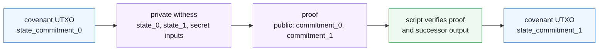
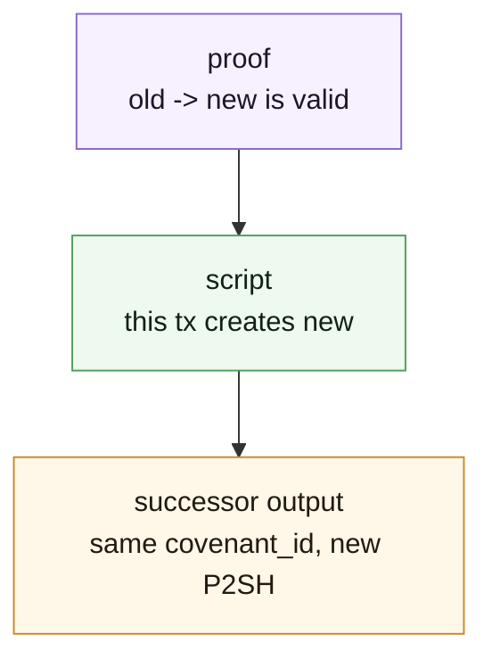
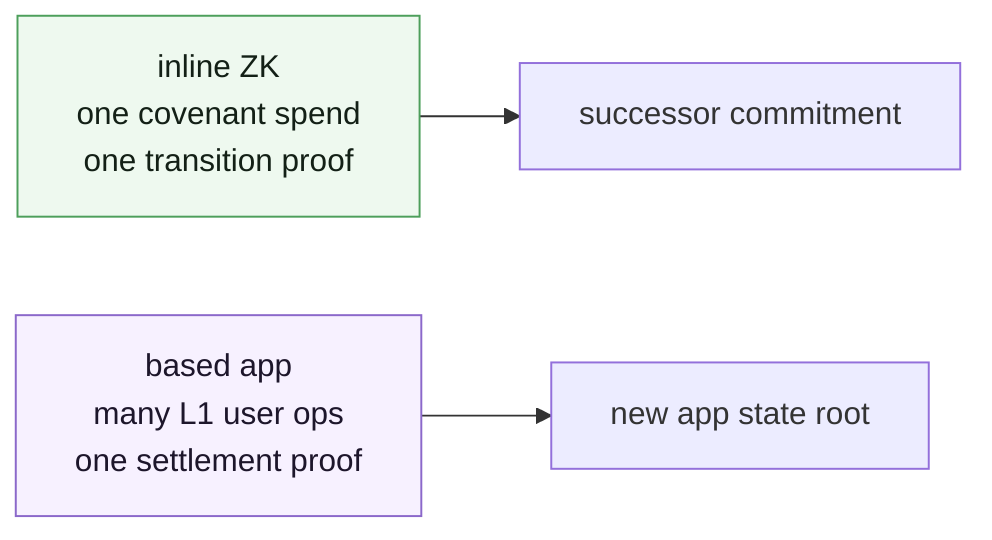

Inline ZK is still a covenant.

The covenant UTXO is spent. The script runs. The successor output is validated. The difference is that part of the transition happened elsewhere and arrives as a proof.



The L1 state can be a commitment instead of the full state. The transition function can run off-chain. The script only accepts the next UTXO if the proof binds the old commitment, the new commitment, and the exact program the covenant intended to use.

## What The Proof Buys

Without ZK, a covenant script has to execute the transition logic directly or inspect enough public data to validate it.

With inline ZK, the script can say:

```text
I will not rerun the transition.
I will verify that a specific proving program accepted it.
I will bind the proof output to my successor covenant state.
```

That changes the shape of a covenant. The public script can stay small while the private or expensive check lives in the proof system.

It does not remove the covenant work. The script still has to validate the output it is creating.

## `OpZkPrecompile`

Toccata exposes proof verification through `OpZkPrecompile`.

The precompile dispatches by tag:

| Tag    | Proof system       | Shape                                                                        |
| ------ | ------------------ | ---------------------------------------------------------------------------- |
| `0x20` | Groth16            | compact BN254 proof, not post-quantum                                        |
| `0x21` | RISC Zero Succinct | STARK-based RISC Zero receipt, larger, with post-quantum security properties |

The script should treat a proof as meaningful only under the exact verification key, image id, public inputs, and state commitments it expects. A proof that is valid for the wrong program is not useful to the covenant.

## The Covenant Still Owns The Output

Inline ZK is a proof check inside the covenant loop.

```text
spend(proof, old_commitment, new_commitment, output_idx):
    require(old_commitment == current_state_commitment)
    require(zk_verify(program_id, proof, [old_commitment, new_commitment]))
    require(output[output_idx].covenant_id == current_covenant_id)
    require(output[output_idx].script_public_key == p2sh(contract, new_commitment))
```

The proof says the hidden transition is valid. The script says the transaction actually installs the proven next commitment.

Those are different checks. You need both.



## Where Inline ZK Fits

Inline ZK fits when each action can settle on its own:

- a private transfer covenant;
- a vault whose unlock condition depends on private data;
- a game or league covenant that checks a proprietary bot-detection predicate;
- a bridge-like covenant that verifies an external-state proof;
- a credential or membership predicate where the public chain should only see the accepted result.

The state transition may be private, expensive, or both. The public L1 state can stay as a hash.

## Where It Stops Fitting

Inline ZK becomes awkward when the app really wants a shared off-chain runtime.

Watch for these signs:

- many users mutate one shared state root;
- proofs should be batched over many user operations;
- exits are derived from a span of activity, not one covenant action;
- users should submit ordinary payload transactions instead of covenant spends;
- the app needs lane-local L1 ordering.

At that point, the shape is no longer "one covenant action, one proof." It is a based app.

## Inline ZK And Based Apps

Inline ZK and based apps share proof verification, but they use it at different scales.



Inline ZK is a local covenant technique. Based apps are an execution architecture.

Continue with [Based Apps](./based-apps).
