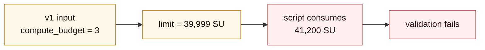

Script pricing is where a beautiful covenant either runs or dies.

The script engine does not care that the transaction looked structurally valid. If the active input runs out of committed execution room, validation fails.

```text
spent input -> compute_budget -> script-unit limit -> script execution
```

The move in Toccata is simple: replace the old signature-count budget with a runtime meter that can price the work covenants actually do.

## The Unit Ladder

There are three names in play.

| Name             | Where it lives              | Current conversion             |
| ---------------- | --------------------------- | ------------------------------ |
| `compute_budget` | v1 transaction input        | `1 budget = 100 compute grams` |
| compute gram     | transaction mass accounting | `1 gram = 100 script units`    |
| script unit      | script-engine runtime meter | charged as the VM runs         |

So one v1 compute-budget unit buys:

```text
1 compute_budget = 100 compute grams = 10,000 script units
```

A v0 `sig_op_count` remains a compatibility path:

```text
1 sig_op_count = 1,000 compute grams = 100,000 script units
```

Each input also gets a fixed free allowance of `9,999` script units.

For v1:

```text
allowed_script_units = compute_budget * 10,000 + 9,999
```

The allowance is one unit less than a full compute-budget step. That gives tiny scripts some room without letting budget `N - 1` cover exactly `N` budget units of work.

| Required script units | Required v1 `compute_budget` |
| --------------------- | ---------------------------- |
| `0`                   | `0`                          |
| `9,999`               | `0`                          |
| `10,000`              | `1`                          |
| `19,999`              | `1`                          |
| `20,000`              | `2`                          |

## What The Meter Charges

The meter follows runtime work, not only signatures.

It charges:

- newly pushed stack bytes;
- hashing opcodes;
- signature verification attempts;
- ZK precompile verification;
- spent UTXO script public key bytes above the standard size.

That is why v1 needs `compute_budget`. A static sig-op count cannot price `OpBlake3`, covenant byte construction, stack growth, or `OpZkPrecompile`.

## Small Scripts Fail Too

A common debugging path looks like this:



The script did not fail because the state rule was wrong. It failed because the input did not buy enough execution room.

Budget too high has the opposite cost: mass goes up, fees go up, and block admission gets worse. Generated builders should estimate script units and set the input budget, not ask users to guess.

## Current Costs

The exact constants below are the current Toccata pricing surface.

Hashing:

| Opcode             | Cost                        |
| ------------------ | --------------------------- |
| `OP_SHA256`        | `1 SU` per hashed byte      |
| `OpBlake2bWithKey` | `2 SU` per hashed data byte |
| `OpBlake2b`        | `2 SU` per hashed byte      |
| `OpBlake3`         | `1 SU` per hashed byte      |
| `OpBlake3WithKey`  | `1 SU` per hashed data byte |

Stack and script-public-key events:

| Event                                                | Cost                    |
| ---------------------------------------------------- | ----------------------- |
| Bytes newly pushed into execution stacks             | `1 SU` per byte         |
| Spent UTXO script public key above standard 35 bytes | `100 SU` per extra byte |

Signature verification:

```text
1 verification attempt = 100,000 SU
```

That cost applies to Schnorr/ECDSA signature checks and to each cryptographic verification attempt inside multisig-style opcodes.

ZK precompile verification:

| Tag    | Proof system       | Cost                                               |
| ------ | ------------------ | -------------------------------------------------- |
| `0x20` | Groth16            | `14,000,000 SU + 250,000 SU * (public inputs + 1)` |
| `0x21` | RISC Zero Succinct | `25,000,000 SU`                                    |

For Groth16, the variable part follows the `gamma_abc` element count, which is public inputs plus one.

## Budget Sizing By Hand

Suppose an input script uses:

- one signature verification: `100,000 SU`;
- 2 KB of BLAKE3 hashing: `2,048 SU`;
- about 1 KB of new stack bytes: `1,024 SU`.

Total:

```text
103,072 SU
```

Apply the free allowance:

```text
charged = 103,072 - 9,999 = 93,073 SU
budget  = ceil(93,073 / 10,000) = 10
```

That input should carry:

```text
compute_budget = 10
```

For ZK, the numbers are intentionally large. A RISC Zero Succinct verification alone costs:

```text
25,000,000 SU
budget = ceil((25,000,000 - 9,999) / 10,000) = 2,500
```

A Groth16 proof with 5 public inputs costs:

```text
14,000,000 + 250,000 * (5 + 1) = 15,500,000 SU
budget = ceil((15,500,000 - 9,999) / 10,000) = 1,550
```

Those examples are sizing intuition, not a substitute for tooling. Real builders should compute the budget from the generated script and proof path they are actually submitting.

If you are building inside `rusty-kaspa`, or mirroring its rules in another builder, the canonical helper is:

```rust
ComputeBudget::checked_covering_script_units(required_script_units)
```

It subtracts the per-input free allowance, rounds up to the smallest `compute_budget` that covers the required script units, and returns `None` if the result cannot fit in the v1 `u16` budget field.

## Why Budget Is Outside The Signature

V1 signatures do not sign `compute_budget`.

That is not a convenience feature. It keeps user intent separate from resource fitting. A relayer, wallet, or miner can adjust the execution budget so the transaction has enough room to validate without changing the txid or invalidating signatures.

The block-level transaction hash still commits to the budget. Once mined, the block commits to the resource choice.

## What To Do In Tooling

For covenant tooling:

- estimate script units during transaction construction;
- use `ComputeBudget::checked_covering_script_units(...)` or an exact equivalent for the tightest valid budget;
- if implementing the conversion yourself, account for the 9,999 SU allowance before converting to `compute_budget`;
- keep budget adjustment outside the user's signed policy;
- show budget failures as resource failures, not state-transition failures;
- size ZK settlement transactions from the actual proof tag and public input count.

Continue with [Inline ZK](./inline-zk) for proof verification inside covenants, or [Based Apps](./based-apps) for proof-batched app execution.
