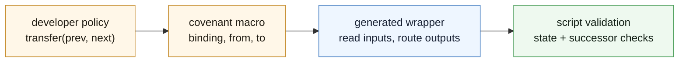
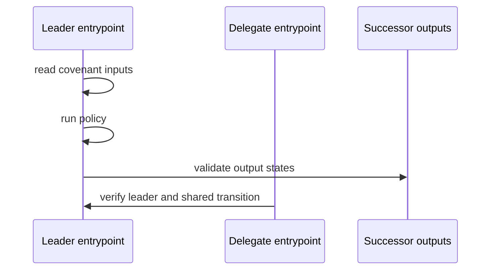

Writing raw covenant script is possible. It also means debugging low-level stack behavior directly.

Silverscript is the normal authoring path for Toccata covenants. You write the state and transition policy. The compiler handles low-level stack encoding, ABI shape, state validation helpers, and the repetitive covenant plumbing.

> [!IMPORTANT]
> Silverscript is still moving toward its audited release shape. Treat it as the intended covenant authoring direction, but check the repo and release notes before shipping production value.

## State Becomes The Current Script

Start with a small vault.

```js
pragma silverscript ^0.1.0;

contract Vault(pubkey owner, int unlock_time, int init_amount) {
    int amount = init_amount;

    entrypoint function spend(sig owner_sig) {
        require(tx.time >= unlock_time);
        require(checkSig(owner_sig, owner));
    }
}
```

In an account-contract language, `amount` might feel like a storage slot. In a Toccata covenant, it is closer to a constant in the current redeem-script preimage.

The live UTXO commits to the script. The script preimage pushes the current state. The spend reveals that preimage. The next output must commit to the next script preimage.

Silverscript exists so the developer can mostly write:

```text
old state + arguments + transaction facts -> allowed new state
```

instead of manually assembling:

```text
stack layout + introspection opcodes + P2SH reconstruction + covenant bindings
```

## Transaction Facts Without Raw Stack Work

Covenants need to read the transaction they are inside.

Silverscript exposes that through high-level transaction objects and opcode-like helpers.

```js
require(tx.outputs[0].value == tx.inputs[this.activeInputIndex].value);

byte[32] cov_id = OpInputCovenantId(this.activeInputIndex);
int in_count = OpCovInputCount(cov_id);
int out_idx = OpAuthOutputIdx(this.activeInputIndex, 0);
```

This narrows the review surface. Reviewers can ask "which outputs are validated?" rather than reverse-engineering raw stack choreography.

## Covenant Macros

The hard part of a covenant is rarely the arithmetic. It is the transaction shape.

Silverscript covenant declarations let the developer say what kind of transition this is, then let the compiler generate the wrapper.

```js
contract Token(int max_ins, int max_outs, int init_amount, byte[32] init_owner) {
    int amount = init_amount;
    byte[32] owner = init_owner;

    #[covenant(binding = cov, from = max_ins, to = max_outs)]
    function transfer(State[] prev_states, State[] new_states, sig[] sigs) {
        int total_in = 0;
        for(i, 0, prev_states.length, max_ins) {
            total_in = total_in + prev_states[i].amount;
        }

        int total_out = 0;
        for(i, 0, new_states.length, max_outs) {
            total_out = total_out + new_states[i].amount;
        }

        require(total_in == total_out);
    }
}
```

The policy says conservation. The macro says how the surrounding transaction is organized.



Generated covenant wrappers should be consistent. The same leader/delegate and output-validation patterns should appear the same way across contracts.

## Auth Binding And Cov Binding

Two transaction views come up constantly.

Use **auth binding** when the active input authorizes its own successors.

```js
#[covenant(binding = auth, from = 1, to = max_outs)]
function split(State prev_state, State[] new_states) {
    require(new_states.length > 0);
}
```

The generated code can focus on:

```text
OpAuthOutputCount(active_input)
OpAuthOutputIdx(active_input, k)
```

Use **cov binding** when a transition spans inputs and outputs sharing the same covenant id.

```js
#[covenant(binding = cov, from = max_ins, to = max_outs)]
function merge(State[] prev_states, State[] new_states) {
    require(new_states.length == 1);
}
```

The generated code needs the shared covenant context:

```text
OpInputCovenantId(active_input)
OpCovInputCount(cov_id)
OpCovInputIdx(cov_id, k)
OpCovOutputCount(cov_id)
OpCovOutputIdx(cov_id, k)
```

Auth binding is about "what did this input authorize?" Cov binding is about "what belongs to this covenant family in this transaction?"

## Leader And Delegate Lowering

For many-input transitions, one input usually leads.



The leader does the expensive work: reading states, running the policy, and validating outputs. Delegates verify that a valid leader exists and that they are not being pulled into the wrong transition.

This pattern is easy to get subtly wrong by hand. It is much easier to review when generated consistently.

## Foreign Templates

Multi-contract apps need one contract to validate another contract's state.

The common shape is:

```text
template prefix + state bytes + template suffix
```

Silverscript has template-aware helpers for that pattern:

```js
validateOutputStateWithTemplate(
  output_idx,
  next_player,
  player_prefix,
  player_suffix,
  player_template,
);
```

The script verifies that the output state is encoded under the expected template, not merely that some output exists.

That is the bridge from one-contract covenants to contract families.

## Covenant-Native Ownership

Toccata ownership does not have to mean "a public key signed."

A KCC20-like pattern can accept different owner identifiers:

```js
if(prev_states[i].identifierType == IDENTIFIER_PUBKEY) {
    require(checkSig(sigs[i], prev_states[i].ownerIdentifier));
} else if(prev_states[i].identifierType == IDENTIFIER_SCRIPT_HASH) {
    byte[] spk = new ScriptPubKeyP2SH(prev_states[i].ownerIdentifier);
    require(tx.inputs[witnesses[i]].scriptPubKey == spk);
} else if(prev_states[i].identifierType == IDENTIFIER_COVENANT_ID) {
    require(OpInputCovenantId(witnesses[i]) == prev_states[i].ownerIdentifier);
} else {
    require(false);
}
```

The covenant-id branch is the key point. A covenant can own something as a covenant, not only through a key. That is where UTXO-native composition differs from account-style composition.

## Tooling Shape

The current workspace includes:

- `silverc`, the compiler;
- Rust compilation APIs;
- `build_sig_script` support for entrypoint ABI;
- a source-level debugger;
- tests and covenant declaration fixtures.

Useful local commands:

```bash
cargo test -p silverscript-lang
cargo run -p cli-debugger -- silverscript-lang/tests/examples/if_statement.sil --function hello
```

## What To Tell An Agent

When using coding agents, give them the covenant shape before asking for code.

Tell them:

- use Silverscript unless raw script is explicitly needed;
- identify whether the transition is `1:1`, `1:N`, `N:M`, leader/delegate, or multi-contract;
- validate successor outputs, not only old inputs;
- use covenant IDs for lineage, but do not confuse them with transition validation;
- keep state small enough for script limits and transaction mass;
- use template-aware helpers for foreign contract state;
- assume a single global mutable UTXO is a bottleneck unless the app can tolerate it.

Continue with [Argent](./argent) for multi-contract source and route lowering.
