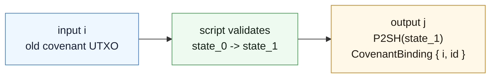
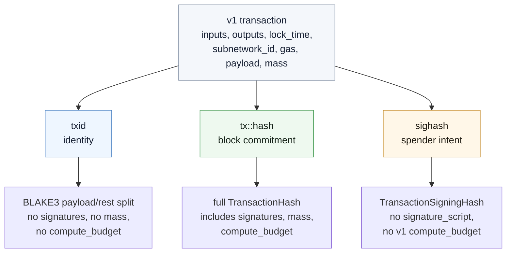

A covenant can compute the next state, but it cannot create the next UTXO by wishing.

The spending transaction has to carry the right body:

- enough execution budget for the script to run;
- outputs that can carry covenant lineage;
- a lane and payload surface for based-app traffic;
- hash contexts that separate identity, block commitment, and user signatures.

That is transaction version 1.

## The Old Body Was Too Narrow

Version 0 is still the ordinary Kaspa transaction shape. It has inputs, outputs, `lock_time`, `subnetwork_id`, `gas`, `payload`, and a mass commitment.

The narrow part is inside the input:

```rust
TransactionInputV0 {
    previous_outpoint: TransactionOutpoint,
    signature_script: Vec<u8>,
    sequence: u64,
    sig_op_count: u8,
}
```

`sig_op_count` is a legacy resource commitment. It prices signature checks. It does not describe byte manipulation, hashing, covenant introspection, or proof verification well.

The output is narrow too:

```rust
TransactionOutputV0 {
    value: u64,
    script_public_key: ScriptPublicKey,
}
```

There is no place for an output to say: "I am the authorized successor of covenant id `X`, created by input `i`."

## What V1 Moves

V1 keeps the outer transaction body familiar and changes the parts Toccata needs.

V1 moves execution metering into `compute_budget` and gives outputs a place to carry covenant lineage.

<div className="not-prose my-6 grid gap-4 md:grid-cols-2">
  <div className="rounded-lg border bg-card p-4 text-sm">
    <div className="mb-3 font-semibold">Version 0</div>
    <div className="space-y-3">
      <div className="rounded-md border bg-background p-3">
        <div className="font-medium">Transaction</div>
        <div className="mt-2 grid gap-1 text-muted-foreground">
          <span>version</span>
          <span>inputs[]</span>
          <span>outputs[]</span>
          <span>lock_time</span>
          <span>subnetwork_id</span>
          <span>gas</span>
          <span>payload</span>
          <span>mass</span>
        </div>
      </div>
      <div className="rounded-md border bg-background p-3">
        <div className="font-medium">Input</div>
        <div className="mt-2 grid gap-1 text-muted-foreground">
          <span>previous_outpoint</span>
          <span>signature_script</span>
          <span>sequence</span>
          <span className="font-semibold text-foreground">sig_op_count: u8</span>
        </div>
      </div>
      <div className="rounded-md border bg-background p-3">
        <div className="font-medium">Output</div>
        <div className="mt-2 grid gap-1 text-muted-foreground">
          <span>value</span>
          <span>script_public_key</span>
        </div>
      </div>
    </div>
  </div>

  <div className="rounded-lg border bg-card p-4 text-sm">
    <div className="mb-3 font-semibold">Version 1</div>
    <div className="space-y-3">
      <div className="rounded-md border bg-background p-3">
        <div className="font-medium">Transaction</div>
        <div className="mt-2 grid gap-1 text-muted-foreground">
          <span>version</span>
          <span>inputs[]</span>
          <span>outputs[]</span>
          <span>lock_time</span>
          <span className="font-semibold text-foreground">subnetwork_id</span>
          <span className="font-semibold text-foreground">gas</span>
          <span className="font-semibold text-foreground">payload</span>
          <span>mass</span>
        </div>
      </div>
      <div className="rounded-md border bg-background p-3">
        <div className="font-medium">Input</div>
        <div className="mt-2 grid gap-1 text-muted-foreground">
          <span>previous_outpoint</span>
          <span>signature_script</span>
          <span>sequence</span>
          <span className="font-semibold text-foreground">compute_budget: u16</span>
        </div>
      </div>
      <div className="rounded-md border bg-background p-3">
        <div className="font-medium">Output</div>
        <div className="mt-2 grid gap-1 text-muted-foreground">
          <span>value</span>
          <span>script_public_key</span>
          <span className="font-semibold text-foreground">covenant: Option&lt;CovenantBinding&gt;</span>
        </div>
      </div>
    </div>
  </div>
</div>

The implementation uses version-aware encoding around one core transaction model. In practice:

- v0 inputs carry `sig_op_count`;
- v1 inputs carry `compute_budget`;
- v0 outputs must not carry covenant bindings;
- v1 outputs may carry `CovenantBinding`.

The binding shape is small:

```rust
CovenantBinding {
    authorizing_input: u16,
    covenant_id: Hash,
}
```

The meaning is not small. It says that this output belongs to a covenant family and points to the input that authorized its creation.

## Compute Budget Is Not User Intent

It is tempting to treat execution budget as part of the spender's permanent policy.

Version 0 couples those concerns: a v0 sighash commits to sig-op counts. Version 1 separates them. `compute_budget` is a resource commitment, not the user's covenant policy.

For a v1 input:

```text
compute_budget -> compute mass -> script-unit limit
```

If the budget is too low, validation fails. If it is too high, the transaction pays more mass and becomes harder to admit. But changing it does not change the v1 txid and does not invalidate the v1 signature.

The full pricing ladder belongs in [Script Pricing](./script-pricing). The transaction chapter only needs the structural fact: v1 puts the budget on each input, and only the full transaction hash commits to it.

## Covenant Binding Lives On The Successor

A covenant spend usually creates at least one successor output.

The old state is in the spent input. The new state is represented by an output: value, script public key, and optionally covenant binding.



Consensus can reject an output that tries to enter a covenant family without authorization. It does not prove that the new state is correct. The script still has to inspect the transaction and verify that the successor output is the one the covenant allows.

A covenant binding on a key-spend output does not turn that key-spend into a covenant. If the script never reads covenant data, it never enforces covenant rules.

## Lanes And Gas Are Ordinary Fields

The `subnetwork_id`, `gas`, and `payload` fields existed before v1, but Toccata changes what version 1 transactions may do with them.

Post-Toccata valid subnetwork shapes include:

| Shape                             | Meaning                                          |
| --------------------------------- | ------------------------------------------------ |
| `[0x00, 0x00 * 19]`               | native                                           |
| `[0x01, 0x00 * 19]`               | coinbase                                         |
| `[namespace: 4 bytes, 0x00 * 16]` | user lane, if `namespace[1..=3]` is not all-zero |

Equivalently, the only valid `[x, 0x00 * 19]` shapes are native and coinbase. Other 19-zero-suffix IDs are reserved system shapes, not user lanes.

Only v1 user-lane transactions may carry non-zero `gas`. Native and reserved system shapes stay gas-free.

For a based app, this means the user operation can be a boring L1 transaction:

```text
subnetwork_id = app lane
gas           = lane admission commitment
payload       = app operation bytes
```

The app-specific meaning of that payload is not a consensus concern. The lane and payload become useful because KIP-21 gives later proofs an app-local sequencing commitment to bind to.

## Three Projections Of One Transaction

The same v1 transaction is viewed through three different commitments.



The split is not aesthetic. It keeps three jobs from stepping on each other:

- **txid** identifies the logical transaction. For v1 it is `TransactionV1Id(PayloadDigest(payload) || TransactionRest(rest_preimage))`.
- **`tx::hash`** commits to the full encoded transaction for block-level commitments, including mass and v1 `compute_budget`.
- **sighash** captures the spender's signed intent. In v1 it does not sign `compute_budget`, but it does sign covenant output bindings when those outputs are covered by the sighash type.

The payload appears in two different hash worlds. The v1 txid uses the BLAKE3 `PayloadDigest`. The sighash uses the legacy signing payload hash path. Do not reuse one as the other.

## Commitment Matrix

| Field                               | txid                  | `tx::hash` | sighash                      |
| ----------------------------------- | --------------------- | ---------- | ---------------------------- |
| `version`                           | yes                   | yes        | yes                          |
| input outpoint and sequence         | yes                   | yes        | yes                          |
| input signature script              | empty placeholder     | yes        | no; signer signs spent SPK   |
| v0 `sig_op_count`                   | no                    | yes        | yes                          |
| v1 `compute_budget`                 | no                    | yes        | no                           |
| output value and script public key  | yes                   | yes        | yes, subject to sighash type |
| output covenant binding             | yes                   | yes        | yes, subject to sighash type |
| `lock_time`, `subnetwork_id`, `gas` | yes                   | yes        | yes                          |
| payload                             | v0 raw; v1 via digest | yes, raw   | yes, signing payload hash    |
| transaction mass                    | no                    | yes        | no                           |

## Builder Traps

- If you use v0 txid logic for v1, every downstream proof and index will point at the wrong thing.
- If you expect signatures to freeze `compute_budget`, budget adjustment will fail for the wrong reason.
- If you attach a covenant binding but the successor script never validates covenant state, the binding is lineage metadata, not transition validation.
- If you treat user lanes like account-chain shards, you will miss the based-app model: they are L1 transaction lanes for ordering and proof anchoring.
- If two hashes disagree, first ask which projection you are looking at: txid, `tx::hash`, or sighash.

Continue with [Script Pricing](./script-pricing) for budget sizing, or return to [Covenant State](./covenant-state) for successor validation.
